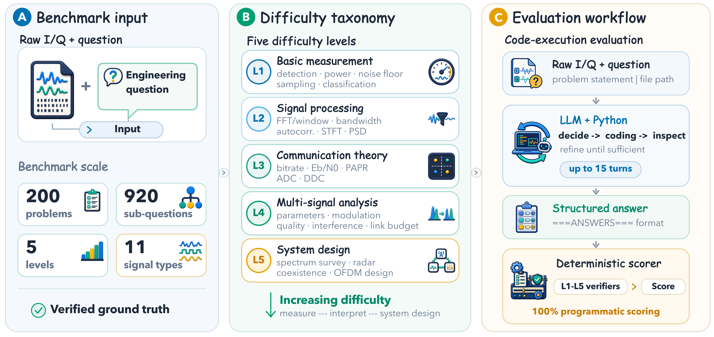
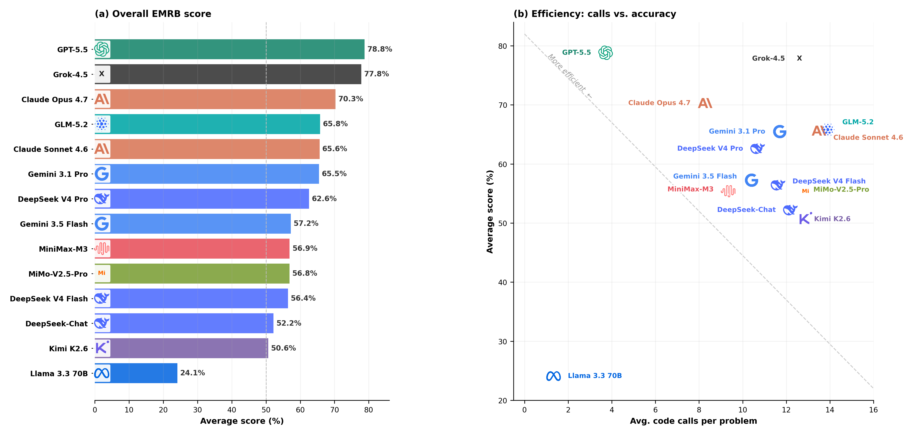
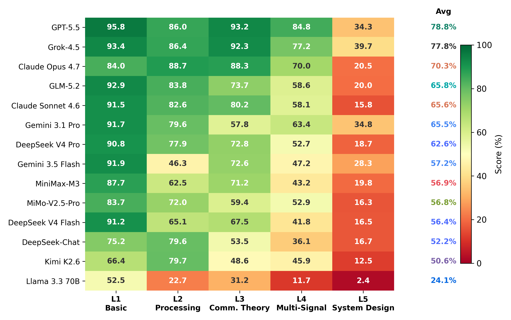
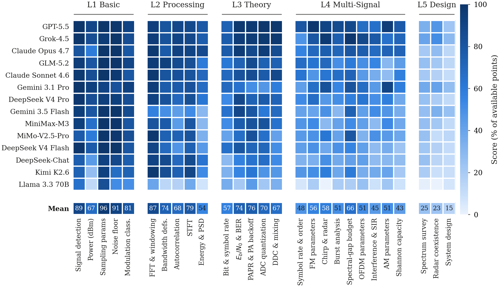
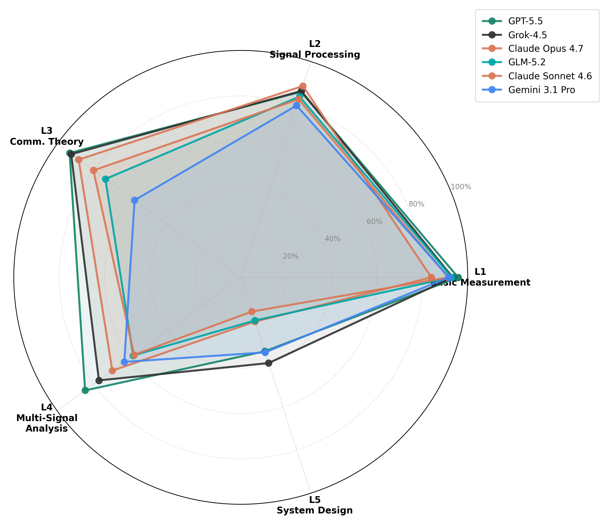
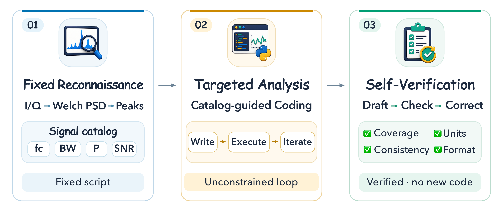
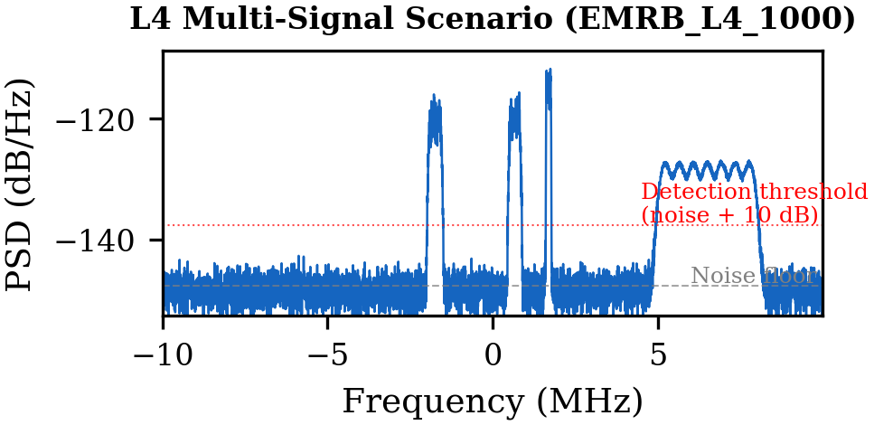

<div align="center">

# EMRB: A Multi-Level Benchmark for Evaluating LLM Reasoning over Raw Electromagnetic Signals

**Mingxu Zhang, Ying Sun, Yuhan Li, Yang Ji, Dazhong Shen, Ke Zhang, Shan Huang**

*Submitted to KDD 2027 Datasets & Benchmarks Track*

[](https://arxiv.org/abs/2608.24086)
[](LICENSE)
[](LICENSE-DATA)
[]()
[]()

[Paper](https://arxiv.org/abs/2608.24086) | [Dataset](#benchmark-data) | [Leaderboard](#leaderboard) | [ReconPilot](#reconpilot) | [Quick Start](#quick-start) | [Citation](#citation)

</div>

## Overview

Unlike benchmarks built on preprocessed features or structured tables, **EMRB** provides only the raw I/Q capture; the quantities each question refers to must first be discovered through code. The model receives a question and `.npy` signal data, writes Python code to analyze the signals, executes it in a sandbox, iterates, and produces structured answers.

<div align="center">

<br/>
<sub><b>Figure 1.</b> EMRB framework overview. (A) Each problem pairs a raw I/Q capture with an engineering question. (B) Five difficulty levels from basic measurement to system design, spanning 27 question types and 11 signal types. (C) The LLM agent writes and executes Python code iteratively, then answers are scored by fully deterministic verifiers.</sub>
</div>

## Leaderboard

Scores range from **24.1%** (Llama 3.3 70B) to **78.9%** (GPT-5.5) across 14 LLMs, with no ceiling effect.

<div align="center">

<br/>
<sub><b>Figure 2.</b> (a) Overall EMRB scores across 14 LLMs. (b) Efficiency frontier: accuracy vs. average code calls per problem.</sub>
</div>

<br/>

<div align="center">

<br/>
<sub><b>Figure 3.</b> Per-level scores (%) for all 14 models. The mean drops from 84.9% on L1 (basic measurement) to 21.2% on L5 (system design).</sub>
</div>

<br/>

<div align="center">

<br/>
<sub><b>Figure 4.</b> Fine-grained breakdown across all 27 question types. Bottom row shows the cross-model mean.</sub>
</div>

<br/>

<div align="center">

<br/>
<sub><b>Figure 5.</b> Top 6 models across all five levels. No single model dominates every level.</sub>
</div>

## ReconPilot

EMRB includes **ReconPilot**, a structured 3-stage pipeline that separates signal reconnaissance from targeted analysis:

<div align="center">

<br/>
<sub><b>Figure 6.</b> ReconPilot pipeline: fixed reconnaissance produces an unresolved spectral region map, which guides a free-form analysis loop, followed by deterministic self-verification.</sub>
</div>

<br/>

| Stage | What it does | Turns |
|:-----:|--------------|:-----:|
| **Stage 1: Reconnaissance** | Fixed code template localizes occupied spectral regions and flags time/frequency behavior. Produces an unresolved region map (not a signal catalog). | 1 |
| **Stage 2: Analysis** | Standard free-form agent loop. The model receives the reconnaissance summary as context and solves all sub-questions. | up to 12 |
| **Stage 3: Verification** | Deterministic self-consistency checks (e.g., bitrate vs. modulation order, missing sub-questions). Guides one repair pass if inconsistencies are found. | up to 3 |

Across three backbones, ReconPilot raises the overall score by **3.8 to 17.6 points** and improves 13 of 15 backbone-level combinations.

To run with ReconPilot:

```bash
python evaluate.py --level L3 --all --model gpt-4o --workers 8 --pipeline
```

## Benchmark Data

Each problem provides a raw I/Q capture as a `.npy` file. The model must discover signal structure through code.

<div align="center">

<br/>
<sub><b>Figure 7.</b> Example PSD of an L4 multi-signal scenario with 4 signals above the noise floor.</sub>
</div>

<br/>

- **200 problems** across 5 levels (40 per level, 8 archetypes x 5 seeds)
- **920 sub-questions** total (5 per problem at L1-L4, 3 at L5)
- **11 signal types**: BPSK, QPSK, 8PSK, 16QAM, 64QAM, FM, AM-DSB, OFDM, 2FSK, 4FSK, Chirp
- **27 question types** with zero overlap across levels

| Level | Theme | Sub-Qs | Topics |
|:-----:|-------|:------:|--------|
| **L1** | Basic Measurement | 5 | Signal detection, power, sampling params, noise floor, classification |
| **L2** | Signal Processing | 5 | FFT/windowing, bandwidth, autocorrelation, STFT, energy/PSD |
| **L3** | Communication Theory | 5 | Bitrate/symbol rate, Eb/N0 & BER, PAPR, ADC quantization, DDC/mixing |
| **L4** | Multi-Signal Analysis | 5 | Symbol rate, FM, chirp/radar, burst, link budget, OFDM, interference, AM, Shannon |
| **L5** | System Design | 3 | Spectrum survey, radar coexistence, OFDM system design |

Pre-generated data is in `data/`. To regenerate (deterministic, seeded):

```bash
python generate.py --level L1    # -> data/L1/  (40 problems)
python generate.py --level L2    # -> data/L2/
python generate.py --level L3    # -> data/L3/
python generate.py --level L4    # -> data/L4/
python generate.py --level L5    # -> data/L5/
```

## Quick Start

### Installation

```bash
git clone https://github.com/mingxuZhang2/EMRB.git
cd EMRB
pip install -r requirements.txt
```

### Configuration

```bash
export EMRB_API_KEY="your-api-key"
export EMRB_API_BASE_URL="https://api.openai.com/v1"   # or any OpenAI-compatible endpoint
```

To add a new model, edit the `MODEL_PROVIDERS` dict in `evaluation/config.py`.

### Run Evaluation

```bash
# Single problem
python evaluate.py --level L3 --id EMRB_L3_4000 --model gpt-4o

# All problems in a level (parallel)
python evaluate.py --level L1 --all --model gpt-4o --workers 8

# All levels
for level in L1 L2 L3 L4 L5; do
  python evaluate.py --level $level --all --model gpt-4o --workers 8 --skip-existing
done

# With ReconPilot pipeline
python evaluate.py --level L3 --all --model gpt-4o --workers 8 --pipeline

# Re-score existing results (no re-running)
python evaluate.py --level L3 --all --model gpt-4o --score-only --workers 8
```

### CLI Flags

| Flag | Description |
|------|-------------|
| `--level L1..L5` | Required. Which level to evaluate |
| `--id EMRB_L3_4000` | Run a single problem by ID |
| `--all` | Run all problems in the level |
| `--n 10` | Run first N problems only |
| `--model gpt-4o` | Model name (must be in `config.py`) |
| `--max-turns 15` | Max agent loop iterations (default: 15) |
| `--workers 8` | Parallel evaluation threads (default: 1) |
| `--score-only` | Re-score existing responses without re-running |
| `--skip-existing` | Skip problems that already have results |
| `--pipeline` | Use 3-stage ReconPilot pipeline |

## Scoring

All scores are **fully deterministic** with no LLM judge. Per-level verifiers (`l{1-5}_verifier.py`) implement:

- **Entity-bound matching**: each answer is validated against the specific signal and sub-question it refers to
- **Quantity-specific tolerances**: e.g., +/-0.5 MHz for center frequencies, +/-2 dB for power levels
- **Prerequisite-gated scoring** (L5): downstream answers are scored only if the prerequisite is correct
- **Provenance fingerprints**: results carry task and scorer version hashes for reproducibility

## Directory Structure

```
EMRB/
├── README.md
├── LICENSE                    # MIT (code)
├── LICENSE-DATA               # CC BY 4.0 (benchmark data)
├── requirements.txt
├── evaluate.py                # Evaluation CLI
├── generate.py                # Problem generation CLI
├── evaluation/
│   ├── config.py              # Model/API configuration
│   ├── runner.py              # Free-form agent loop
│   ├── pipeline_runner.py     # ReconPilot 3-stage pipeline
│   ├── executor.py            # Sandboxed Python execution
│   ├── l{1-5}_verifier.py     # Deterministic scorers per level
│   └── auto_scorer.py         # Answer parsing utilities
├── generation/
│   ├── signal_library.py      # 11 signal generators
│   ├── question_library.py    # L4 question templates
│   └── generate_l{1-5}_batch.py  # Per-level problem generators
├── data/
│   ├── L1/                    # 40 problems (.json + .npy)
│   ├── L2/
│   ├── L3/
│   ├── L4/
│   └── L5/
├── tests/                     # Verifier test suite
└── assets/                    # Figures
```

## Citation

If you use EMRB in your research, please cite:

```bibtex
@misc{zhang2026emrbmultilevelbenchmarkevaluating,
      title={EMRB: A Multi-Level Benchmark for Evaluating LLM Reasoning over Raw Electromagnetic Signals},
      author={Mingxu Zhang and Ying Sun and Yuhan Li and Yang Ji and Dazhong Shen and Ke Zhang and Shan Huang},
      year={2026},
      eprint={2608.24086},
      archivePrefix={arXiv},
      primaryClass={cs.AI},
      url={https://arxiv.org/abs/2608.24086},
}
```

## License

- **Code**: [MIT License](LICENSE)
- **Data**: [CC BY 4.0](LICENSE-DATA)
